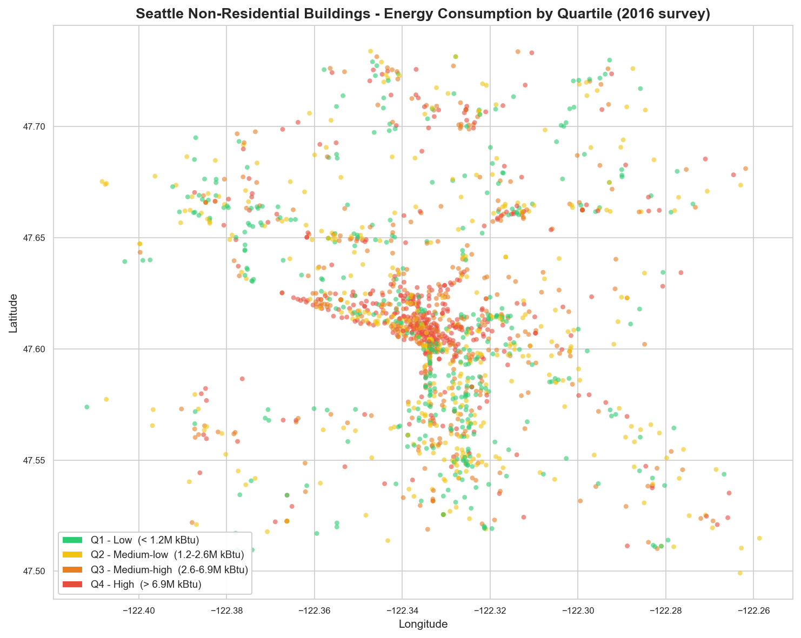
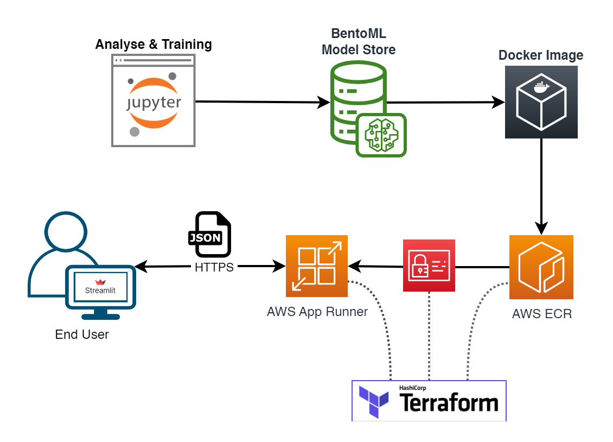
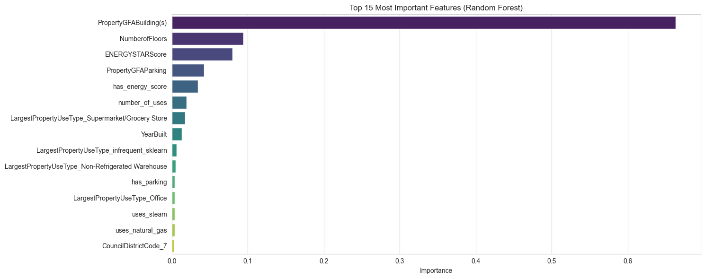
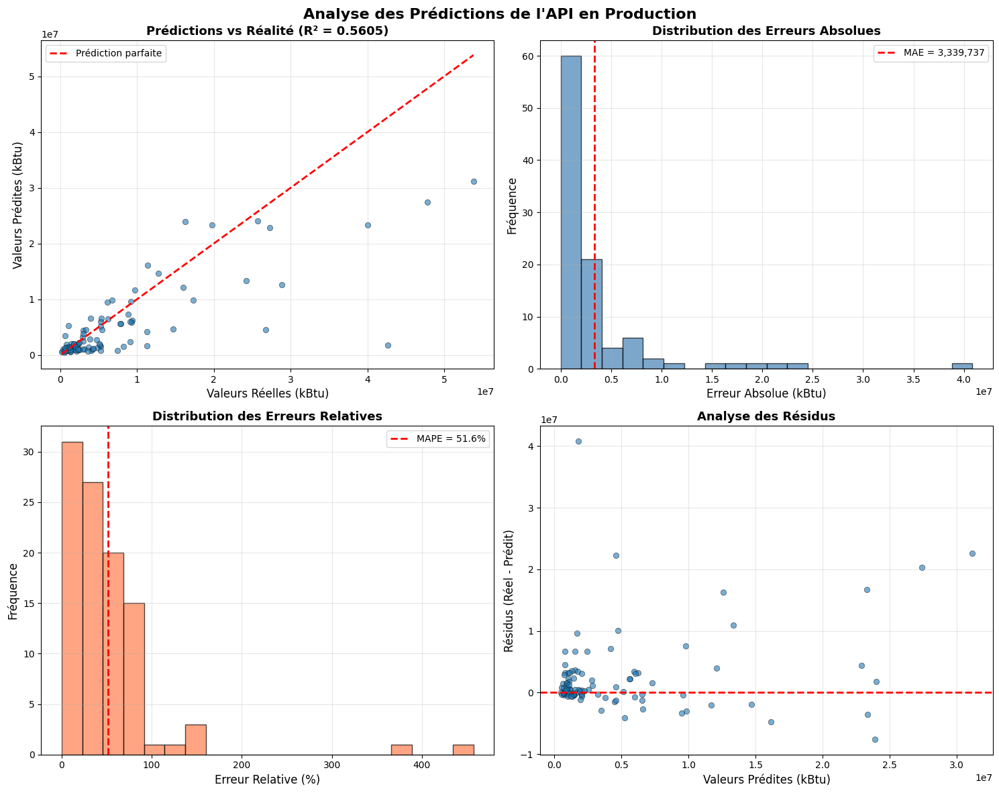

# Building Energy Consumption Predictor

> Predict the total site energy use of non-residential buildings from structural data alone — and serve predictions via a production-ready REST API.


[](assets/project_presentation.pdf)

---

## Overview

Energy surveys of commercial buildings are expensive and rare. This project trains a **Random Forest Regressor** on Seattle's 2016 building benchmarking data to predict `SiteEnergyUse(kBtu)` from structural features (floor area, building type, number of floors, energy score, etc.) — no energy meter readings required at inference time. The trained model is packaged with **BentoML**, containerized, and deployed on **AWS App Runner** behind a validated REST API. The full cloud infrastructure is reproduced with **Terraform**.

---

## 🏷️ Building Energy Consumption Predictor

**Estimate a commercial building's annual energy footprint from its structural profile — in one API call.**

---

## 🎯 The Challenge

*Simulated business case — City of Seattle (fictional client).*

Seattle targets **carbon neutrality by 2050**. A key bottleneck: energy surveys of non-residential buildings are costly and slow, leaving large gaps in the city's data. The ask was to build a predictive model that could estimate a building's total energy consumption from data that is already available — size, usage type, age, location — and expose it as a real-time API so that building owners or city agents can get instant estimates without waiting for an on-site measurement.

The raw dataset: **3,376 building records** collected in 2016, with 46 features each. The scatter plot below shows their geographic distribution by latitude and longitude, colored by energy consumption quartile.



---

## 💡 The Solution & Architecture

The diagram below shows the full pipeline — from model training in the notebook to a live HTTPS endpoint on AWS, with infrastructure fully managed by Terraform.



### Data pipeline

Starting from 3,376 raw records, a structured 5-step pipeline produces a clean training set:

| Step | Action | Records |
| --- | --- | --- |
| Raw data | 46 features, 3,376 buildings | 3,376 |
| Scope filter | Exclude residential `BuildingType` (e.g. Multifamily) | 1,668 |
| Usage filter | Regex filter — exclude rows with Family/Residence/Residential in usage columns | 1,628 |
| Outlier removal | 99th percentile cap on target | ~1,590 |
| Final training set | 12 selected features | ~1,590 |

Key data decisions:

- **Target:** `SiteEnergyUse(kBtu)` — 98.71% coherent with Electricity + Gas + Steam sub-metering. `SiteEUI` discarded (only 54% coherent).
- **Usage feature:** `LargestPropertyUseType` preferred over `PrimaryPropertyType` — the latter had 15% of values labeled "Other" (a catch-all with no functional meaning) vs. only 6% for `LargestPropertyUseType`, making it a more reliable categorical feature.
- **Data leakage guard:** Raw energy sub-sources (`Electricity(kBtu)`, `NaturalGas(kBtu)`) excluded. Only structural binary flags kept (`uses_steam`, `uses_natural_gas`).
- **ENERGYSTARScore:** 34% missing — imputed with median at training time and replicated at inference via the API.

### Feature engineering

Four derived features created from domain reasoning:

- `number_of_uses` — count of distinct property use types (usage complexity proxy)
- `has_parking` — binary flag from `PropertyGFAParking > 0`
- `has_energy_score` — binary flag: was `ENERGYSTARScore` actually measured?
- `uses_steam`, `uses_natural_gas`, etc. — structural energy source indicators (not consumption values)

### Model selection

Four models evaluated with cross-validation on identical train/test splits:

| Model | R² Test | R² Train | MAE (kBtu) |
| --- | --- | --- | --- |
| **Random Forest** | **0.638** | 0.943 | 2,435,436 |
| SVR | 0.615 | 0.934 | 2,710,202 |
| Linear Regression | 0.558 | 0.621 | 3,141,596 |
| Dummy baseline | -0.003 | 0.000 | 5,446,359 |

Random Forest selected. Iterative optimization (GridSearchCV → feature selection to 12 features → log-transform of target) yields the final model: **R²=0.626, MAPE=68.66%**.

The chart below shows the importance of each feature in the final model. Building floor area alone accounts for 66% of the predictive power — a strong signal that size is the primary energy driver.



### Live validation on 2017 out-of-sample data

The deployed API was tested against 2017 Seattle benchmarking data (entirely unseen during training): **R²=0.5605**, MAE=3,339,737 kBtu. The model generalizes year-over-year with consistent performance. The 4-panel dashboard below shows the prediction vs. actual scatter, absolute and relative error distributions, and residual analysis.



---

## 🛠️ Tech Stack

| Layer | Tool |
| --- | --- |
| Language | Python 3.11+ |
| Data / EDA | pandas, matplotlib, seaborn |
| ML | scikit-learn (RandomForestRegressor, GridSearchCV, OneHotEncoder, Pipeline) |
| API serving | BentoML 1.4 |
| Input validation | Pydantic v2 |
| Containerization | Docker (image built via `bentoml containerize`) |
| Cloud registry | AWS ECR |
| Cloud serving | AWS App Runner (1 vCPU / 2 GB, eu-west-3) |
| Infrastructure as Code | Terraform (hashicorp/aws ~> 5.0) |
| Dependency management | Poetry |

---

## 🚀 How to Run

### Prerequisites

- Python 3.11+, Poetry installed
- Docker (for local option)
- AWS CLI configured + Terraform installed (for cloud option)

```bash
git clone https://github.com/abguven/building-energy-prediction-api.git
cd building-energy-prediction-api
poetry install
```

Then run `notebooks/analyse.ipynb` end-to-end — it trains the model and saves it to the BentoML model store.

> **Note:** `DO_GRID_SEARCH` is set to `False` by default. The notebook will train directly using the best hyperparameters found during development (takes a few seconds). Set it to `True` only if you want to rerun the full GridSearchCV — this can take several hours.

---

### Option A — Local with Docker

#### Step 1 — Activate the Poetry environment

Linux / macOS:

```bash
eval $(poetry env activate)
```

Windows (PowerShell):

```powershell
& "$(poetry env info --path)\Scripts\Activate.ps1"
```

#### Step 3 — Build the image

```bash
cd bentoml_service
bentoml build .
bentoml containerize seattle_energy_predictor:latest
```

`bentoml containerize` creates a Docker image tagged with a short hash (e.g. `seattle_energy_predictor:cy2bhmzl2ocwrfhc`). Get the exact tag with:

```bash
docker images | grep seattle_energy_predictor
```

#### Step 4 — Run

```bash
# Replace <TAG> with the hash from the previous command
docker run --rm -p 3000:3000 seattle_energy_predictor:<TAG>
```

#### Step 5 — Test

Open `http://localhost:3000` for the Swagger UI, or use the validation notebook:

```bash
# In validation/api_test.ipynb — set BASE_URL = "http://localhost:3000"
jupyter notebook validation/api_test.ipynb
```

#### Step 6 — Streamlit demo app (optional)

```bash
# Ensure API_URL in app.py points to http://localhost:3000/predict
streamlit run app.py
```

---

### Option B — AWS deployment with Terraform

The Terraform configuration is split into two independent modules with distinct responsibilities:

- `terraform/infra/` — provisions ECR + IAM. Apply once, keep it running.
- `terraform/service/` — provisions App Runner. Apply after each image push, destroy when not in use.

#### Step 1 — Provision the base infrastructure (once)

```bash
cd terraform/infra
terraform init
terraform apply
```

This creates the ECR repository and the IAM role. Note the outputs:

```text
ecr_repository_url     = "123456789.dkr.ecr.eu-west-3.amazonaws.com/seattle-energy-predictor"
apprunner_iam_role_arn = "arn:aws:iam::123456789:role/AppRunnerECRAccessRole"
```

#### Step 2 — Push the Docker image to ECR

```bash
ECR_URL=$(terraform output -raw ecr_repository_url)

aws ecr get-login-password --region eu-west-3 | \
  docker login --username AWS --password-stdin $ECR_URL

# Replace <TAG> with your image hash — get it with: docker images | grep seattle_energy_predictor
docker tag seattle_energy_predictor:<TAG> $ECR_URL:latest
docker push $ECR_URL:latest
```

#### Step 3 — Deploy App Runner

```bash
cd ../service
terraform init
terraform apply
```

Terraform reads the ECR URL and IAM role ARN directly from the `infra` state — no manual variables needed. It outputs the public HTTPS endpoint:

```text
apprunner_service_url = "https://xxxxxx.eu-west-3.awsapprunner.com"
```

#### Streamlit demo app (optional)

```bash
# Set API_URL in app.py to your App Runner endpoint, then:
streamlit run app.py
```

#### Tear down when done

App Runner is billed per second of active compute. Destroy only the service — ECR and IAM stay intact:

```bash
cd terraform/service
terraform destroy
```

ECR and IAM can stay — they cost near nothing and avoid re-pushing the image on the next session.

---

### Example API call

```bash
curl -X POST https://<your-url>/predict \
  -H "Content-Type: application/json" \
  -d '{
    "data": {
      "PropertyGFABuilding_s_": 25000,
      "NumberofFloors": 4,
      "ENERGYSTARScore": null,
      "PropertyGFAParking": 0,
      "YearBuilt": 1998,
      "LargestPropertyUseType": "Office",
      "ListOfAllPropertyUseTypes": "Office",
      "CouncilDistrictCode": 7,
      "uses_steam": false,
      "uses_natural_gas": true,
      "uses_electricity": true
    }
  }'
```

Response:

```json
{
  "predicted_SiteEnergyUse(kBtu)": 1284500.50,
  "formatted": "1_284_500.50",
  "warning_messages": [
    "ENERGYSTARScore not provided, replaced with median. Prediction may be less accurate."
  ]
}
```

---

## 🧠 Technical Challenges Overcome

### 1. Data leakage in a highly correlated dataset

The dataset contains columns like `Electricity(kBtu)` and `NaturalGas(kBtu)` which are direct components of the target `SiteEnergyUse(kBtu)`. Including them would produce a near-perfect model that is useless in production — you'd need the answer to predict the answer. The solution: create **binary structural flags** (`uses_electricity`, `uses_natural_gas`) that indicate whether an energy source infrastructure exists in the building, independent of how much it consumes.

### 2. The `transformers.py` duplication constraint

The project contains `transformers.py` in **two locations**:

- `notebooks/transformers.py`
- `bentoml_service/transformers.py`

**This is intentional — do not merge or delete either copy.**

When sklearn serializes the trained model via pickle, it records the full import path of the custom `FeatureDropper` transformer as `transformers.FeatureDropper`. When BentoML loads the pickle at serving time inside the container, Python resolves that path relative to the working directory — which is `bentoml_service/`. If the file is absent or renamed, the service crashes at startup with `ModuleNotFoundError`. Both files must remain **identical and in their respective locations**.

### 3. ENERGYSTARScore: 34% missing, yet the 3rd most important feature

Dropping rows with a missing `ENERGYSTARScore` would have removed a third of the dataset. The solution was median imputation at training time, combined with a companion binary feature `has_energy_score` that lets the model distinguish "score is median because it was missing" from "score is median because the building genuinely performs at median". The API replicates this logic transparently: if the caller omits the score, the median is injected and a warning is included in the response.

### 4. Open source contribution to scikit-learn

During development, a bug was discovered in scikit-learn's `OneHotEncoder`. According to the documentation, `handle_unknown='warn'` should behave like `handle_unknown='infrequent_if_exist'` — mapping unknown categories to the infrequent bucket while emitting a warning. In practice, it was silently behaving like `handle_unknown='ignore'`, mapping unknown categories to all zeros instead. No error was raised, making the bug hard to detect.

In the context of this project, building types unseen at training time (e.g. a new property use type in 2017 data) were being encoded as all-zero vectors instead of being mapped to the infrequent category — corrupting predictions without any indication.

The bug was reported as [scikit-learn/scikit-learn#32589](https://github.com/scikit-learn/scikit-learn/issues/32589) and fixed in [PR #32592](https://github.com/scikit-learn/scikit-learn/pull/32592), merged into scikit-learn 1.8. A custom `FeatureDropper` transformer was implemented as a workaround in the meantime.

### 5. Terraform + Docker + App Runner sequencing

AWS App Runner attempts to pull and start the container immediately upon service creation. If the ECR image does not exist yet, the service enters `CREATE_FAILED` with no meaningful error message. The deployment must follow a strict order: ECR repository first → push image → create App Runner.

The Terraform configuration is split into two independent modules to enforce this order:

- `terraform/infra/` — provisions ECR + IAM once. The ECR repository is configured with `force_delete = true` so it can be destroyed even when images are present. Outputs (`ecr_repository_url`, `apprunner_iam_role_arn`) are written to a local state file.
- `terraform/service/` — provisions App Runner only. It reads the `infra` state directly via `terraform_remote_state`, so no variables need to be passed manually on `apply` or `destroy`.

This split enables clean teardown between sessions: destroy only the App Runner service (billed per second), keep ECR and IAM intact (near-zero cost) to avoid re-pushing the image on the next session.

---

## 📁 Project Structure

```text
city_of_seattle/
├── data/
│   ├── raw/                        # Source data (Seattle Open Data)
│   └── processed/                  # Train/test splits generated by the notebook
├── notebooks/
│   ├── analyse.ipynb               # EDA, feature engineering, training, model export
│   ├── transformers.py             # Custom sklearn transformer (⚠️ see note above)
│   └── helper.py
├── bentoml_service/
│   ├── service.py                  # BentoML API and endpoint logic
│   ├── validation.py               # Pydantic v2 input schema
│   └── transformers.py             # ⚠️ Intentional duplicate — required for pickle deserialization
├── validation/
│   ├── api_test.ipynb              # API test suite with curated test cases
│   ├── api_test_rd.ipynb           # Live validation on 2017 real data (R²=0.5605)
│   └── api_test_cases.json         # Curated test payloads (valid + edge cases)
├── terraform/
│   ├── infra/
│   │   ├── main.tf                 # ECR repository (force_delete) + IAM role
│   │   ├── variables.tf            # Region, repo name, environment
│   │   └── outputs.tf              # ecr_repository_url, apprunner_iam_role_arn
│   └── service/
│       ├── main.tf                 # App Runner — reads infra state via terraform_remote_state
│       ├── variables.tf            # Region, service name, image tag, environment
│       └── outputs.tf              # apprunner_service_url
├── utils/
│   └── tools.py
├── app.py                          # Streamlit demo app
└── pyproject.toml
```

---

## 📊 Data Source

[Seattle Building Energy Benchmarking — Seattle Open Data Portal](https://data.seattle.gov/)

The 2016 dataset is used for training. The 2017 dataset was used for out-of-sample live validation only. Both are publicly available.

---

## 🎤 Project Presentation

[Download the project presentation (PDF)](assets/project_presentation.pdf) — *in French*

---
